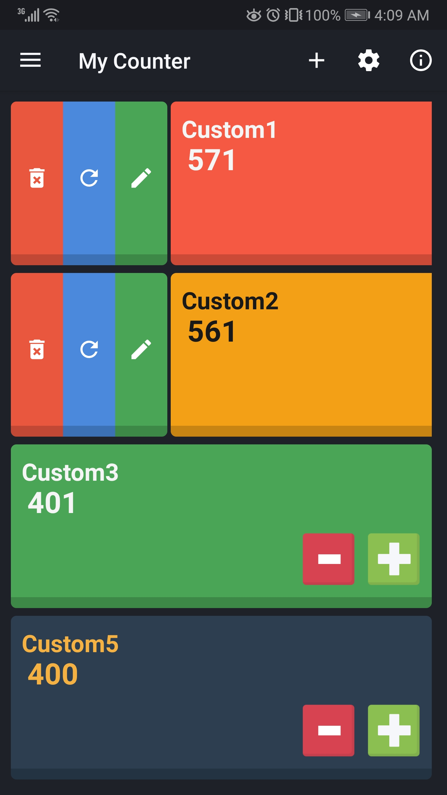
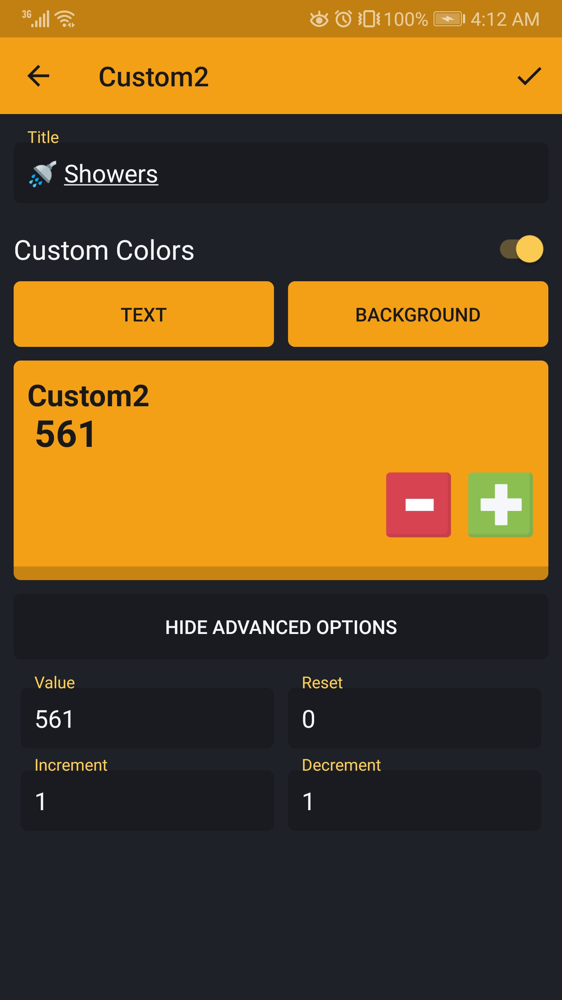
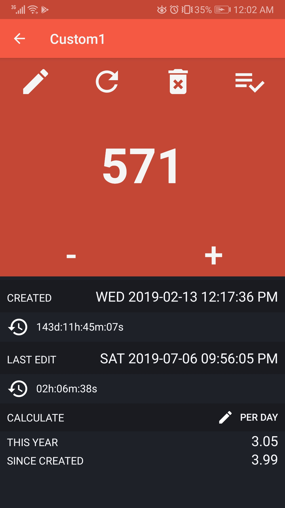
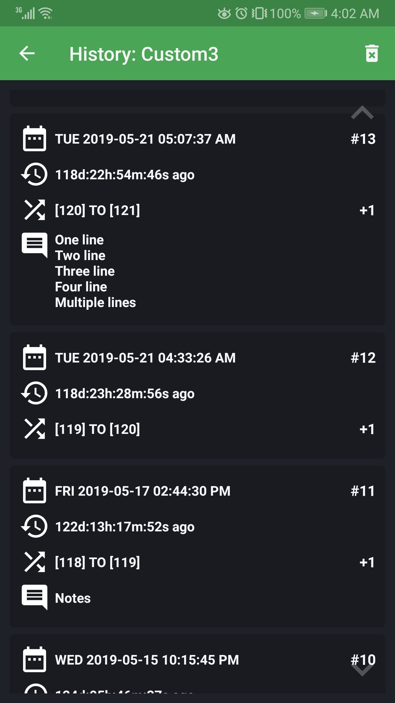
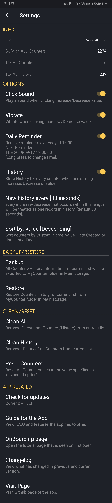
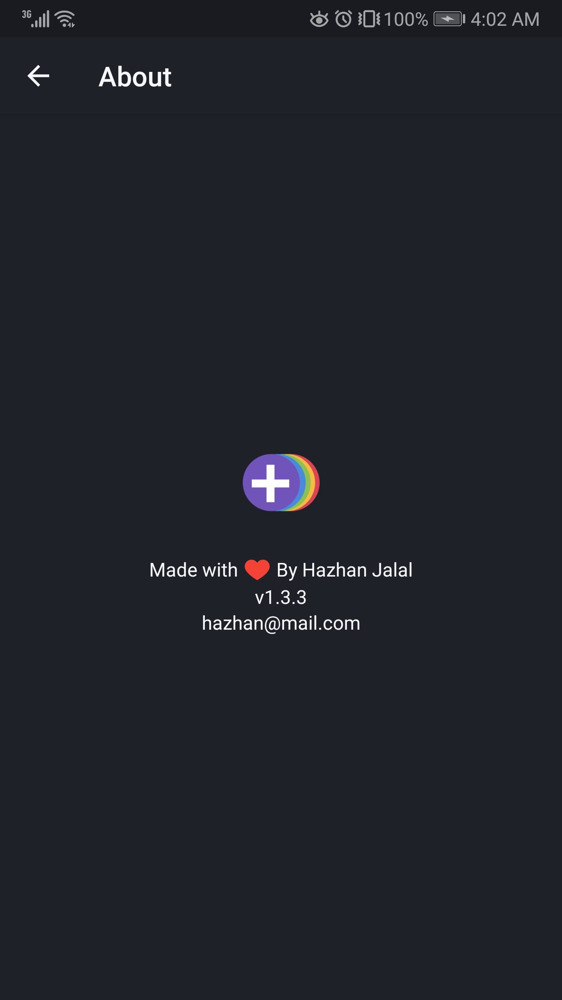

MyCounter
------------
> 

> Version: 1.3.2.1 | min: Android 5.0 (SDK 21)

**DOWNLOAD**
> [MyCounter_v1.3.2.1.apk](https://github.com/H4zh4n/MyCounter/raw/master/APK/MyCounter_v1.3.2.1.apk)

**WHAT'S NEW IN 1.3.2.1?**
+ Notification Icon fix.

**WHAT'S NEW IN 1.3.2?**
+ First time open tutorial (accessible from settings too).
+ Select PER Day/Week/Month.
+ Select how many seconds for history records to be treated as one.
+ New background color (bluish tint).
+ Implemented new notification/in-app messages for future use.
+ Small bug fixes related to deleting counters/histories.

The App Screen
----------------

> Main Screen [Sorted by Value Desc]

> Add/Update Counter Screen

      
> Edit Screen

	
> History Screen

> List Screen

       		
> Settings Screen
 

> About Screen
 
