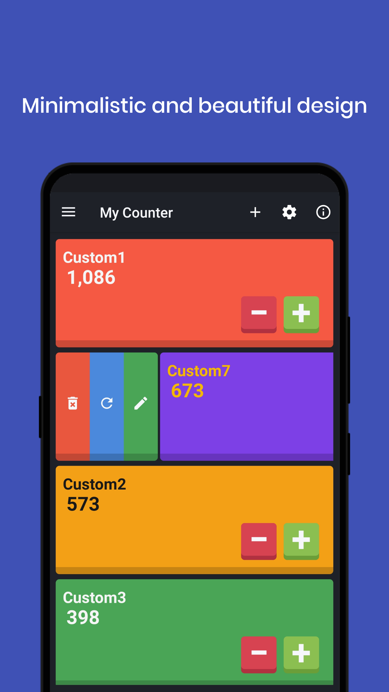
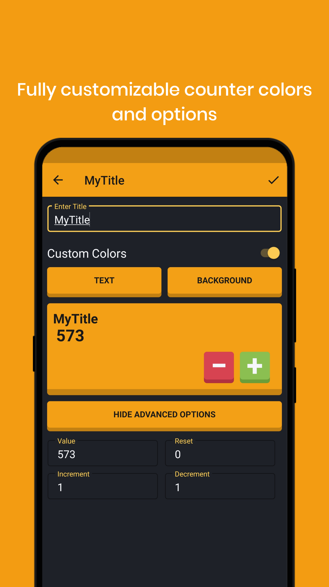
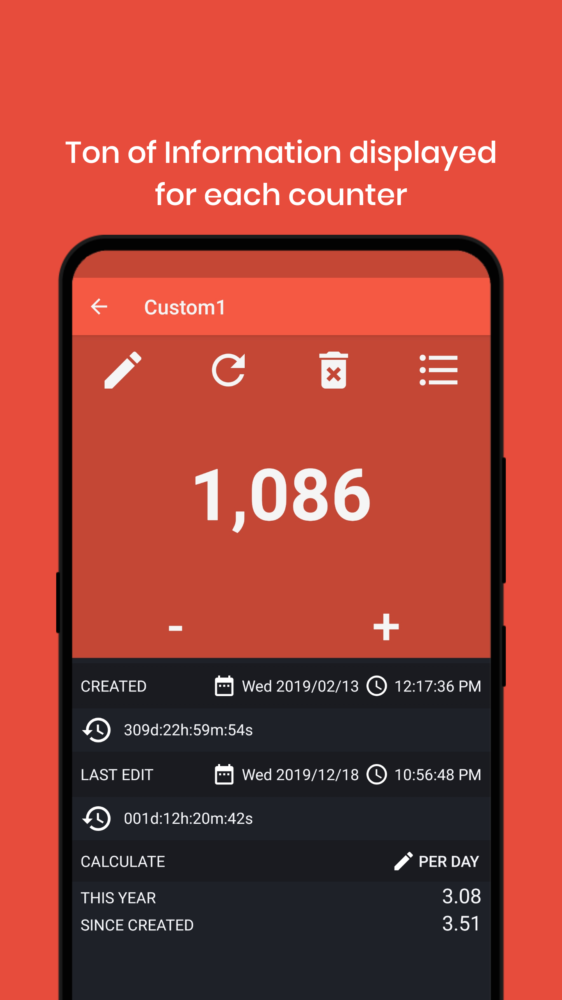
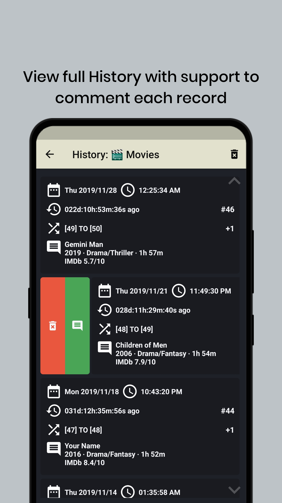
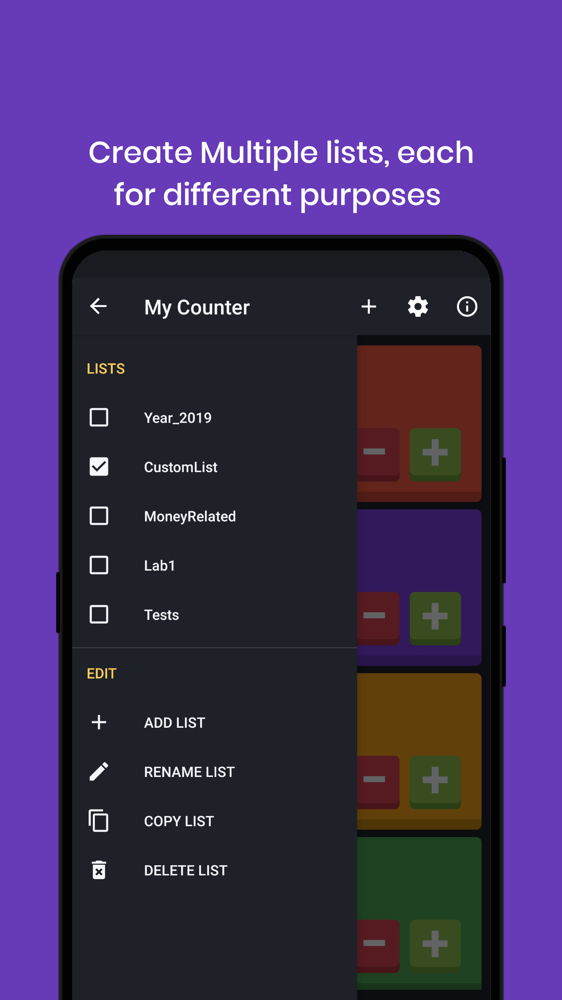
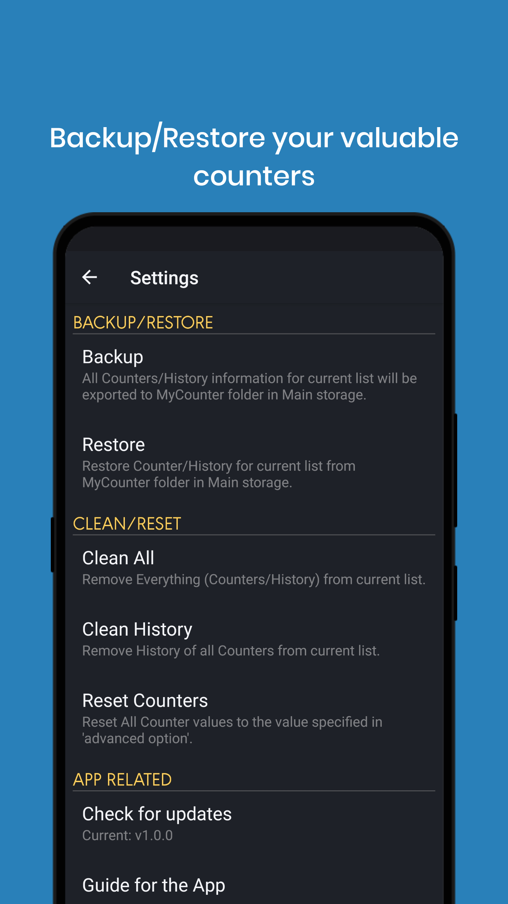
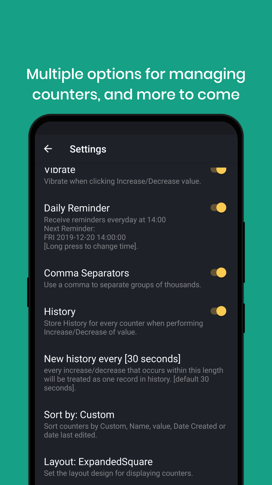

MyCounter
------------
> 

> Version: 1.0.18 | min: Android 5.0 (SDK 21)

**DOWNLOAD**
> [MyCounter_v1.0.18.apk](https://play.google.com/store/apps/details?id=com.dev.hazhanjalal.mycounter)

**WHAT'S NEW IN 1.0.18?**  

• Fix Force Close on some devices.  
• Change History Displayed style.  
• Fixed tiny scrollbar on long lists issue.  
&nbsp;&nbsp;&nbsp;○ Scrolling in History shows the date.  
&nbsp;&nbsp;&nbsp;○ Scrolling in Main shows counter titles.  
• Show warning when list (added/renamed) is a reserved keywords/already exists. [Reported by Miran Esmail] 
• Counter created in a different year has calculate ratio for both years (year created and current).   
• Support Right to left layout (languages).   
• Some other Minor bug fixes.  

The App Screen
----------------

> Main Screen [Sorted by Value Desc]

> Add/Update Counter Screen

      
> Edit Screen

	
> History Screen

> List Screen

       		
> Settings Screen
 
 
